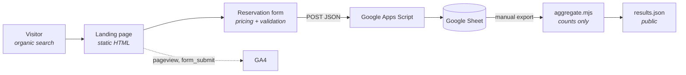

# Primeiro Saque

**A fake-door experiment to test whether tennis players would pay to try premium rackets before
buying them.**

<table>
<tr>
<td align="center"><h3>38</h3>organic reservation requests</td>
<td align="center"><h3>R$ 0</h3>paid media spend</td>
<td align="center"><h3>0</h3>rackets purchased</td>
<td align="center"><h3>São Paulo</h3>April 2026 → running</td>
</tr>
</table>

🎾 **Live product:** [primeirosaque.com.br](https://primeirosaque.com.br) ·
📊 **Case study:** [primeirosaque.com.br/case-study](https://primeirosaque.com.br/case-study/)

> **These are not customers.** 38 people submitted a request form. Nobody has been charged, served
> or contacted, and no payment mechanism exists. Interest is not willingness to pay — the whole
> point of this write-up is the distance between those two things.

---

## The problem

A serious amateur player in Brazil buying a new frame is making a **BRL 1,500–2,500 decision** with
almost nothing to go on.

Shops let you hold the racket. Holding a racket tells you nothing about how it plays. The variables
that actually decide whether a frame suits you — string pattern, swing weight, balance, how it
behaves in the third hour when your timing goes — only surface across several sessions on a real
court. Demo programmes solve this in the US and Europe; in São Paulo they are rare and informal.

So players decide on brand loyalty, a coach's opinion, or which pro endorses the frame — and then
live with it. Get it wrong and you lose the money twice: once on the frame, and again on every
match you play with it.

I play tennis. That is where this came from, not from a market report.

## The hypothesis

Split into four claims so each could be probed separately — or shown to be untestable by this
experiment, which turned out to matter just as much.

|                      | Claim                                                                                              | Status                                         |
| -------------------- | -------------------------------------------------------------------------------------------------- | ---------------------------------------------- |
| **H1 · Problem**     | Players feel racket choice as _money at risk_, not as a performance or injury problem              | Probed — but only one framing was ever tested  |
| **H2 · Solution**    | A one-week, delivered, court-ready trial is legible enough that people raise their hand unprompted | Probed — 38 requests                           |
| **H3 · Pricing**     | BRL 250/week doesn't kill interest, and tiering pushes people toward comparing frames              | Partial — nobody was asked to pay              |
| **H4 · Acquisition** | Search intent reaches this audience affordably                                                     | **Untested** — the campaign was never launched |

Full reasoning, including which hypotheses were explicit at launch and which are retrospective:
[docs/experiment.md](docs/experiment.md).

## Why a fake-door test?

A working version of this business needs inventory (BRL 1,500–2,500 per frame, several per model),
stringing, city-wide logistics, payments, deposits against damage, and someone to run it.
Realistically BRL 15,000–30,000 and a few months — all committed against an assumption nobody had
tested.

The riskiest thing was never whether it could be built. It was whether anyone wanted it.

So none of this was built:

- ❌ **Inventory** — zero rackets purchased
- ❌ **Logistics** — no delivery, no routing
- ❌ **Payments** — no checkout, no Pix, no card
- ❌ **Accounts** — no login, no profiles
- ❌ **A backend** — a spreadsheet behind a 60-line script
- ❌ **A framework** — one HTML file

Total running cost after five months: a domain.

## The MVP

One landing page presenting the service as if it were operating:

- **Catalogue** — four real frames (Babolat, Wilson, Head, Yonex) with real specs, chosen because
  they are what people are actually deciding between
- **The offer** — one week on a real court, fresh strings at your tension, new overgrip, delivery
  and pickup included across São Paulo Capital
- **Pricing** — BRL 250 / 450 / 600 for one, two or three rackets, shown _before_ the form opens,
  with a live total as you select
- **The request** — name, WhatsApp, which frames, how soon, which neighbourhood

The last two fields are what make this an experiment rather than a lead form. **Urgency** is the
only available proxy for real purchase intent. **Neighbourhood** decides whether the business is
physically possible at all — delivery is included in the price, so if requests scatter instead of
clustering, logistics eat the ticket.

Everything the page could have promised and didn't is deliberate: no contact window, no named
channel, no artificial scarcity. The button says _request_, not _book_, because nothing is being
booked.

## Experiment design

Submitting the form writes a row to a spreadsheet and fires a GA4 conversion event. That is the
entire mechanism.

| Captured          | Why                                                    |
| ----------------- | ------------------------------------------------------ |
| Rackets selected  | Which models pull demand → what inventory to buy first |
| Number of rackets | Single test vs. comparison — the direct read on H3     |
| Urgency           | Proxy for purchase-window proximity                    |
| Neighbourhood     | Whether same-day logistics is feasible                 |
| Calculated price  | The value attached to each request                     |
| Name, WhatsApp    | Contact only — no analytical purpose                   |

**No success criteria were defined before launch.** No target count, no threshold, no stop date.
That is the clearest methodological weakness here and it is not fixable retrospectively — any bar
written now would be reverse-engineered from a number already known. It is called out rather than
quietly omitted, and the next experiment defines its criteria up front.

## Early results

_14 April 2026 – present. Experiment ongoing._

| Metric                       | Value            | Confidence                             |
| ---------------------------- | ---------------- | -------------------------------------- |
| Reservation requests         | **38**           | Observed — row count in the sheet      |
| Paid media spend             | **BRL 0**        | Observed — no campaign ever launched   |
| Acquisition                  | **100% organic** | Observed                               |
| Paying customers             | **0**            | Observed — no payment mechanism exists |
| Revenue                      | **BRL 0**        | Observed                               |
| Distinct people among the 38 | _unknown_        | Requires deduplication — see below     |
| Traffic / conversion rate    | _unknown_        | In GA4, not yet exported               |

Nobody was driven to this page. No campaign ran, no ads were bought, no lists were emailed. People
searching for rackets found it and asked for something that does not exist yet, at prices they
could see before they asked.

**What 38 does not mean:**

- **Not 38 customers.** Nobody has been charged, quoted or served.
- **Probably not 38 people.** The sheet contains repeat submissions from the same contacts.
- **Not willingness to pay.** Raising your hand is free.
- **Not a conversion rate.** There is no modal-open event, so pre-form drop-off is invisible.
- **Not a clean sample.** The live page carries fabricated testimonials, whose influence on this
  data cannot be measured — see [the security and privacy review](docs/security-privacy.md#f2--fabricated-testimonials-on-a-live-commercial-page).
- **Not even a firm 38.** The form posts blind, so failed submissions look identical to successes.
  It is a floor.

Full breakdown, with distributions pending a data export: [docs/results.md](docs/results.md).

## What we learned

> Deliberately unwritten. The distributions have not been aggregated yet, and the interpretation is
> the owner's to make — not the repository's to assert. The questions the data can speak to are laid
> out in [docs/results.md](docs/results.md#what-we-learned) with the confounders attached to each.

One conclusion is already available, and it is procedural rather than commercial: an experiment
that runs for five months without a success threshold produces a number that can be _described_ but
not _scored_.

## What we still don't know

| Unknown                         | Why it is decisive                                             |
| ------------------------------- | -------------------------------------------------------------- |
| **Actual willingness to pay**   | The entire hypothesis. Nobody has been asked for money         |
| **CAC under paid acquisition**  | Determines whether this scales past an organic trickle         |
| **Logistics cost per rental**   | Two trips against a BRL 250 ticket may be margin-negative      |
| **Inventory utilisation**       | Weeks-per-frame-per-month sets the whole capital requirement   |
| **Damage, loss and non-return** | Unpriced tail risk that can erase many rentals                 |
| **Repeat demand**               | Someone who buys a racket may not need another trial for years |

## Next experiment

**Ask them for the money.**

A small, paid, closed-loop pilot: contact the existing respondents starting with those who said
"this week", be straightforward about what happened, take BRL 250 up front by Pix, and buy frames
only after the money arrives. Two to four rackets, one neighbourhood cluster, four to six weeks.

Before it starts: resolve the fabricated testimonials, add the missing funnel event, and **write
the success criteria down first** — conversion bar, maximum delivery cost, stop date.

If people who requested a free-to-request trial decline at BRL 250 in volume, the honest reading is
that this measured curiosity rather than demand. That is a genuinely valuable finding, bought for
the price of a few rackets instead of a business.

Full design: [docs/results.md](docs/results.md#next-experiment).

## Architecture



Static HTML on Vercel. A Google Apps Script that appends rows to a spreadsheet. GA4 alongside. No
server, no database, no build step, no runtime dependencies.

**Designed for validation, not scale.** At 38 rows the bottleneck is interpreting data, not storing
it, and a spreadsheet is the right shape for a dataset whose primary consumer is a person. The
constraint that drove everything: _nothing may make a copy change slower._ The cut-over point to
real infrastructure is money changing hands.

The known costs of this — invisible submission failures, no rate limiting, browser-side Tailwind —
are listed honestly in [docs/architecture.md](docs/architecture.md#known-limitations).

## Technical decisions

Product Decision Records with context, reasoning, trade-offs and revisit triggers:
[docs/product-decisions.md](docs/product-decisions.md)

|                                                                                                               |                                                             |
| ------------------------------------------------------------------------------------------------------------- | ----------------------------------------------------------- |
| [PDR-001](docs/product-decisions.md#pdr-001--fake-door-before-buying-inventory)                               | Fake door before buying inventory                           |
| [PDR-002](docs/product-decisions.md#pdr-002--show-real-prices-before-the-form)                                | Show real prices before the form                            |
| [PDR-003](docs/product-decisions.md#pdr-003--one-week-trials)                                                 | One-week trial period                                       |
| [PDR-004](docs/product-decisions.md#pdr-004--google-sheets-and-apps-script-instead-of-a-database)             | Sheets + Apps Script instead of a database                  |
| [PDR-005](docs/product-decisions.md#pdr-005--capture-urgency-and-neighbourhood)                               | Capture urgency and neighbourhood                           |
| [PDR-006](docs/product-decisions.md#pdr-006--no-payment-collection-in-the-fake-door)                          | No payment collection — and why that is the main limitation |
| [PDR-007](docs/product-decisions.md#pdr-007--single-html-file-tailwind-from-a-cdn)                            | Single HTML file, Tailwind from a CDN                       |
| [PDR-008](docs/product-decisions.md#pdr-008--publish-the-case-study-without-linking-it-from-the-landing-page) | Publish the case study unlinked from the landing page       |

## AI-assisted development

This project was built with heavy AI assistance. The claim is **effective AI-assisted execution**,
not autonomous development — AI wrote most of the code; a person decided what the business was,
what the prices were, what the copy said, what would be measured, and what any of it meant.

The write-up is deliberately even-handed about the failure modes — including markup that references
an OG image which has never existed, five months of broken link previews, and a bug in AI-written
code caught by AI-written tests within minutes:
[docs/ai-assisted-development.md](docs/ai-assisted-development.md)

## Security and privacy

An audit of the live product, including what was fixed and what remains open:
[docs/security-privacy.md](docs/security-privacy.md)

Notable: a live spreadsheet formula-injection vulnerability (fixed), personal data collected with
no privacy notice (fixed — there is now a notice at `/privacidade/`), and fabricated testimonials
on a live commercial page (open, documented, the owner's call). Items needing professional legal
review are flagged as such; **no claim of LGPD compliance is made anywhere in this repository.**

## Working with the data

Raw lead exports live in `data/private/`, which is gitignored and never committed. The aggregation
script turns an export into counts only, and refuses to emit anything that looks like a name or a
phone number:

```bash
npm run aggregate        # data/private/reservas.csv → data/results.json
```

Full workflow in [data/README.md](data/README.md).

## Running locally

Requires Node 20+ for the tooling. The site itself has no build step and no runtime dependencies.

```bash
git clone https://github.com/fabiogpereira/primeiro-saque.git
cd primeiro-saque
npm install          # dev tooling only — the site needs none of it
npm run serve        # http://localhost:8000
```

The page loads `assets/js/core.js` as an ES module, so it must be served over HTTP — opening
`index.html` from the filesystem will not work.

| Command             | What it does                                                            |
| ------------------- | ----------------------------------------------------------------------- |
| `npm run serve`     | Serve the site at `localhost:8000`                                      |
| `npm test`          | Pricing, validation and aggregation tests (`node --test`, no framework) |
| `npm run lint`      | ESLint                                                                  |
| `npm run format`    | Prettier                                                                |
| `npm run aggregate` | Rebuild the public aggregate from a local export                        |

**Lead capture** is configured via `ENDPOINT` in `index.html`. With it empty, the form runs in
simulated mode — logs to the console, shows the success screen. Setup:
[backend-setup.md](backend-setup.md).

CI runs lint, format check and tests on every push, plus a guard that fails the build if raw lead
data is ever committed.

## Repository map

```
index.html              # the landing page
assets/js/core.js       # pricing, masking, validation  ← the only tested logic
case-study/             # the public case study (not linked from the landing page — PDR-008)
privacidade/            # LGPD privacy notice
docs/                   # experiment, results, decisions, architecture, AI, security
scripts/                # anonymised aggregation pipeline
tests/                  # node --test
data/private/           # gitignored — raw exports live here and stay here
BRIEFING.md             # the working brief the MVP was generated from
```

## The story, in one paragraph

I play tennis and saw a real problem in how players choose expensive rackets. Instead of building
the business, I built the cheapest credible experiment I could: real products, real prices, a
realistic reservation flow, and nothing behind the door. It produced 38 organic reservation
requests with no paid acquisition. That is evidence of interest, not proof of willingness to pay —
and the next experiment is designed to test exactly that.

---

MIT licensed ([LICENSE](LICENSE)). Racket photography belongs to the respective manufacturers and is
not covered by that licence.
