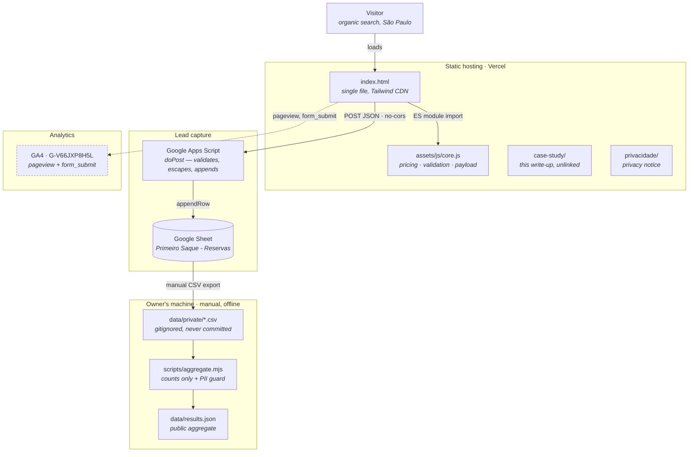
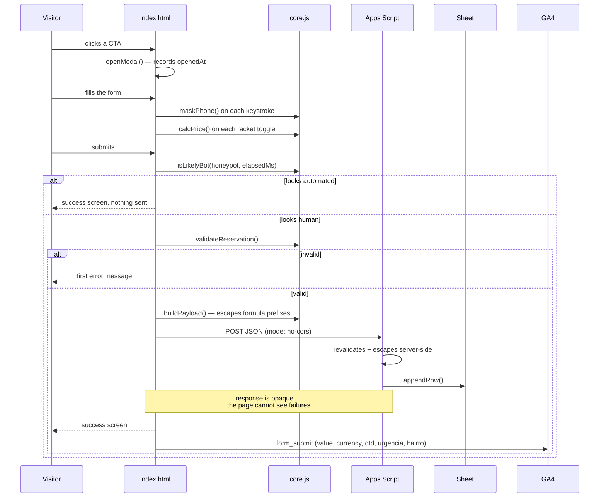

# Architecture

There is not much of it, and that is the point. This document describes what exists, why it was
built this way, and where it breaks.

**Summary:** a static HTML page on a CDN, a Google Apps Script that appends rows to a spreadsheet,
and GA4. No server, no database, no build step, no dependencies at runtime.

---

## The system



The two subgraphs at the bottom never touch each other. GA4 knows about traffic and has no idea
who anyone is; the sheet knows who raised their hand and nothing about how they got there. Joining
them would require an identifier the page deliberately does not create.

## What happens on submit



Note the asymmetry: bot-looking submissions get a success screen and no write. Telling a bot why it
was rejected only helps it retry.

Note also the comment in the middle. The page shows success and fires the analytics event whether
or not the row was actually written. See [Known limitations](#known-limitations).

## Files

```
PrimeiroSaque/
├── index.html              # the landing page — markup, styles, GA4, schema.org
├── assets/js/core.js       # pricing, masking, validation, payload  ← the only tested logic
├── case-study/index.html   # portfolio write-up (not linked from the LP — PDR-008)
├── privacidade/index.html  # privacy notice
├── images/                 # manufacturer product photos
├── scripts/
│   ├── aggregate.mjs       # CSV export → public aggregate, with a PII guard
│   └── csv.mjs             # dependency-free RFC 4180 reader
├── tests/                  # node --test, no framework
├── data/
│   ├── private/            # gitignored — raw exports live here and stay here
│   └── results.json        # committed aggregate (counts only)
└── docs/                   # this directory
```

## Why it is built this way

The constraint was: **nothing may make a copy change slower.**

During validation the dominant activity is rewriting headlines, adjusting prices, and reordering
sections — then seeing the result live. Every layer between an edit and a deploy taxes the thing
that actually matters. So:

| Choice              | What it buys                                                     |
| ------------------- | ---------------------------------------------------------------- |
| No build step       | Edit, push, deployed. A build cannot break because there is none |
| Single HTML file    | A copy change is a one-line diff, readable in `git diff`         |
| Tailwind from CDN   | Restyling needs no toolchain                                     |
| Apps Script + Sheet | Storage, UI and analysis in one artefact. Pivot tables come free |
| Static hosting      | Effectively free, effectively infallible, no ops                 |
| Native ES module    | One testable unit without introducing a bundler                  |

The architecture optimises for **speed of iteration, near-zero cost, and visibility into the
experiment** — not throughput, availability, or scale. At 38 rows the bottleneck is interpreting
data, not storing it.

**What this would cost at scale:** roughly everything. Apps Script has daily execution quotas, a
spreadsheet degrades as a datastore in the thousands of rows, there is no auth, no atomicity, no
backup, and no retention policy. All true, and all irrelevant to the question being asked. The
cut-over point is money changing hands — see
[PDR-004](product-decisions.md#pdr-004--google-sheets-and-apps-script-instead-of-a-database).

## Known limitations

Ordered by how much they affect the conclusions, not by how hard they are to fix.

**1. Submission failures are invisible.** Apps Script returns no CORS headers, so the page posts
with `mode: 'no-cors'` and receives an opaque response. A network failure, a quota error or a
server-side rejection all look identical to success: the user sees the confirmation screen and GA4
records the event. **The recorded submission count is therefore a floor.** Fixing this properly
means either a CORS-capable endpoint or a Vercel serverless function — both of which trade away the
simplicity that makes this architecture appropriate. Documented rather than fixed, because the
error is in a known direction and the magnitude is small at this volume.

**2. GA4 `form_submit` can drift from the sheet.** It fires client-side after the POST regardless of
outcome, so GA4 will count at least as many submissions as the sheet holds. When the two disagree,
the sheet is the system of record.

**3. No modal-open event.** There is no way to distinguish a visitor who never considered the offer
from one who opened the form and abandoned it. Two completely different problems, currently
indistinguishable. This is the highest-value instrumentation gap — see
[results.md](results.md#reservation-funnel).

**4. Redeploying Apps Script issues a new URL.** It must be pasted back into `index.html` by hand.
A silent failure mode: an old deployment stops receiving without any visible error.

**5. Bot protection is client-side.** The honeypot and timing check run in the browser and are
bypassable by anyone reading the source. They stop opportunistic bots, not a determined actor. The
server-side validation in Apps Script is the real boundary. See
[security-privacy.md](security-privacy.md#endpoint-hardening).

**6. Tailwind compiles in the browser.** The CDN build ships a runtime compiler, costing page weight
and render time. Accepted deliberately; becomes worth fixing if paid media launches, since quality
score would turn it into money.

**7. The results pipeline is manual.** Export, run, review, commit. Automating it would mean giving
CI access to a spreadsheet full of personal data — strictly worse. The manual step is a feature:
it forces someone to look at the diff before anything is published.

## Deployment

Push to `main`. Vercel builds nothing and serves the files as they are. DNS for
`primeirosaque.com.br` points at Vercel from Registro.br.

The only manual configuration is `ENDPOINT` in `index.html` — the Apps Script Web App URL, set up
in [backend-setup.md](../backend-setup.md). It is a public endpoint URL rather than a secret, which
is why it sits in the source rather than in an environment variable; the security implications are
covered in [security-privacy.md](security-privacy.md#endpoint-hardening).

CI ([`.github/workflows/ci.yml`](../.github/workflows/ci.yml)) runs lint, format check and tests on
every push. It does not deploy — Vercel does that on its own — and it never touches lead data.
